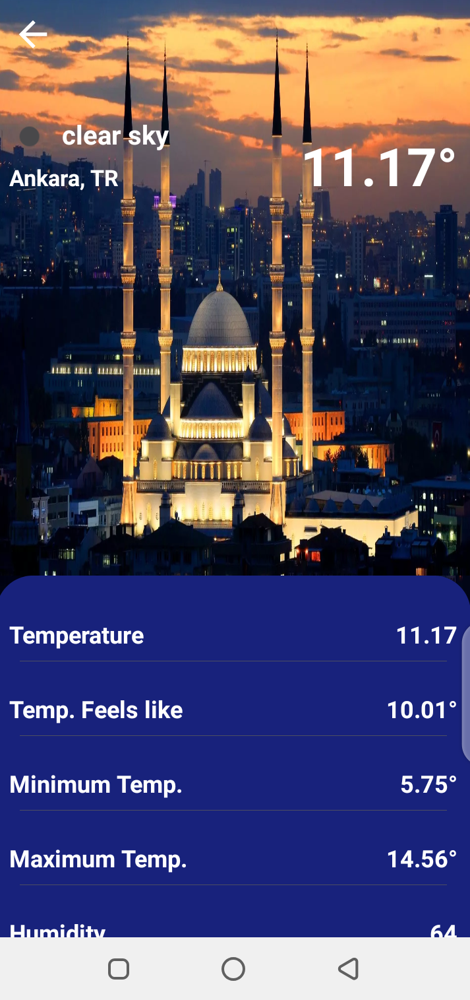

The final app looks like this:

<p align="center"></p>


### Prerequisites

Before running this app,check to confirm there is a file named apikeys.properties else if not found please, create a file named "apikeys.properties", add to the project level files and then add the keys using same format same as  shown below:

```yaml
eg.
WEATHER_API_KEY ="XXXXXXXX"
```

### Background

Design a two-page mobile weather application detailing the weather information for  cities in the table below
 Page One:
  should contain a grid or list showing all the cities in the table below with  Images / Icon to represent each city. Add extra information on each item in the grid  such as name of city, country of city, weather forecast for city and any other  information as deemed fit.
 Page two:
  this should contain a detailed weather report of the selected city in page  one above. A user should be able to select any city in page one and Page two should  display the weather forecast for the selected city.


## System design Approach,
    * The app uses the single activity approach and uses Jetpack navigation to navigate across screen.
    * The WeatherApp class contains an instance of the Dagger component and the a method which can be overridden in the test sourceSet inorder to setup dagger [WeatherTest App]
    * The WeatherFragment class contains the home page which is seen on launch of the application. The application uses flow to get the stream of data asynchronously and stores it to the Room database which serves as a single source of truth for the UI,
    * The Data (Remote and local) and UI packages have their models and communication between the packages are achieved by using mappers to convert form one model to the other.Design patterns used where singleton,Factory and Builder design patterns
    * The setup for testing(End to End,UI,Integration and Unit test where done), and a few unit test where written

## Further improvement to the design
    * Write more tests
    * Add Test coverage dependency (Jacoco) and setup
    * Add more comments and Setup (Dokka) for the purpose of documentation

## Tech-stack

* Tech-stack
    * [Kotlin](https://kotlinlang.org/) - a cross-platform, statically typed, general-purpose programming language with type inference.
    * [Coroutines](https://kotlinlang.org/docs/reference/coroutines-overview.html) - perform background operations.
    * [Flow](https://kotlinlang.org/docs/reference/coroutines/flow.html) - handle the stream of data asynchronously that executes sequentially.
    * [Dagger](https://github.com/google/dagger) - handles dependency injection
    * [Jetpack](https://developer.android.com/jetpack)
        * [Room](https://developer.android.com/topic/libraries/architecture/room) - a persistence library provides an abstraction layer over SQLite.
        * [LiveData](https://developer.android.com/topic/libraries/architecture/livedata) - is an observable data holder.
        * [ViewModel](https://developer.android.com/topic/libraries/architecture/viewmodel) - store and manage UI-related data in a lifecycle conscious way.
        * [Navigation component](https://developer.android.com/guide/navigation)- helps to implement navigation.
* Architecture
    * MVVM - Model View View Model
* Tests
    * [Unit Tests](https://en.wikipedia.org/wiki/Unit_testing) ([JUnit](https://junit.org/junit4/)) - a simple framework to write repeatable tests.
    * [Truth](https://github.com/google/truth) - Assertion library

## License
```
MIT License

Copyright (c) 2021 Favour Olije

Permission is hereby granted, free of charge, to any person obtaining a copy of this software and
associated documentation files (the "Software"), to deal in the Software without restriction, including
without limitation the rights to use, copy, modify, merge, publish, distribute, sublicense, and/or sell
copies of the Software, and to permit persons to whom the Software is furnished to do so, subject to
the following conditions:

The above copyright notice and this permission notice shall be included in all copies or substantial
portions of the Software.

THE SOFTWARE IS PROVIDED "AS IS", WITHOUT WARRANTY OF ANY KIND, EXPRESS OR IMPLIED, INCLUDING BUT NOT
LIMITED TO THE WARRANTIES OF MERCHANTABILITY, FITNESS FOR A PARTICULAR PURPOSE AND NONINFRINGEMENT. IN
NO EVENT SHALL THE AUTHORS OR COPYRIGHT HOLDERS BE LIABLE FOR ANY CLAIM, DAMAGES OR OTHER LIABILITY,
WHETHER IN AN ACTION OF  TORT OR OTHERWISE, ARISING FROM, OUT OF OR IN CONNECTION WITH THE
SOFTWARE OR THE USE OR OTHER DEALINGS IN THE SOFTWARE.
```
